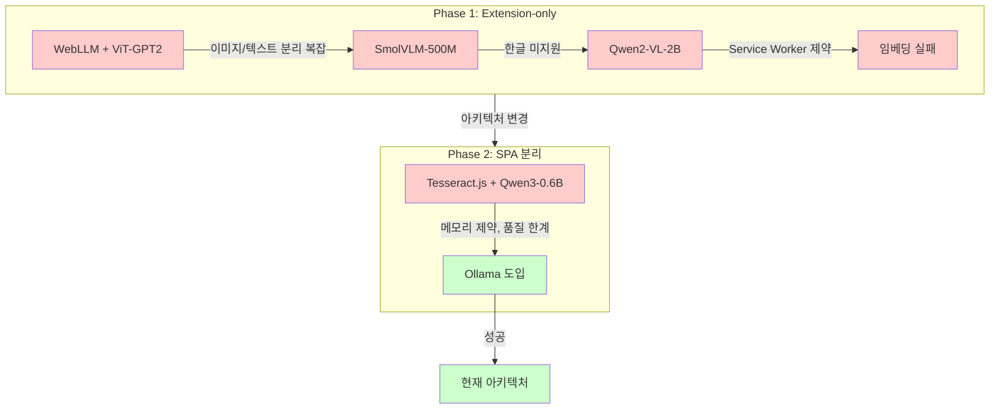
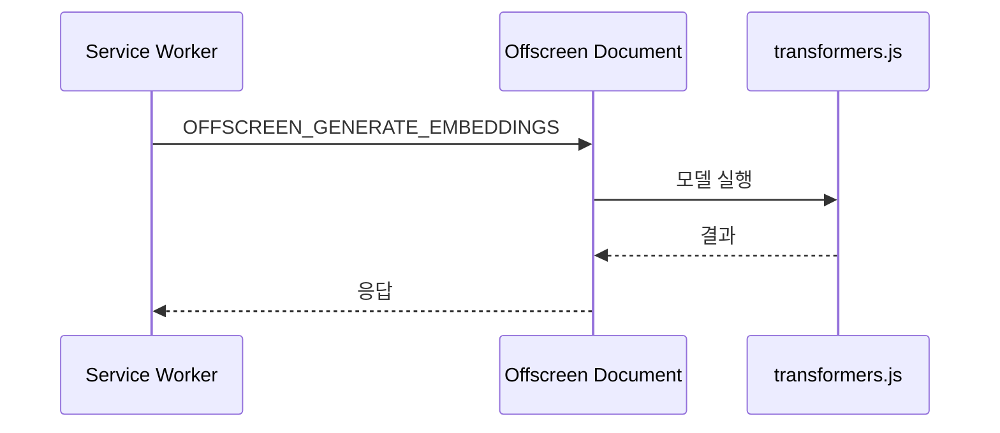
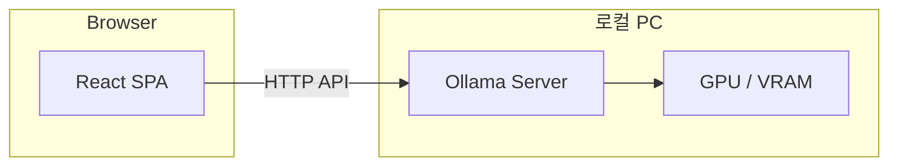
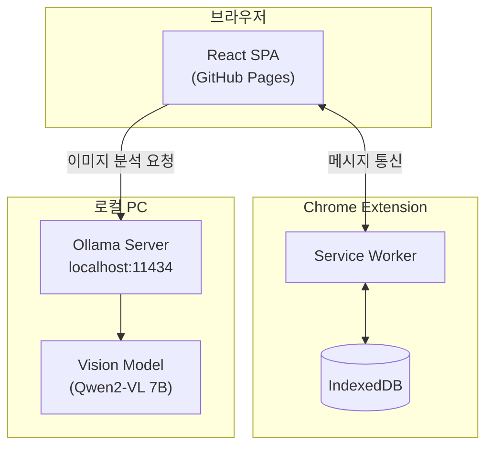
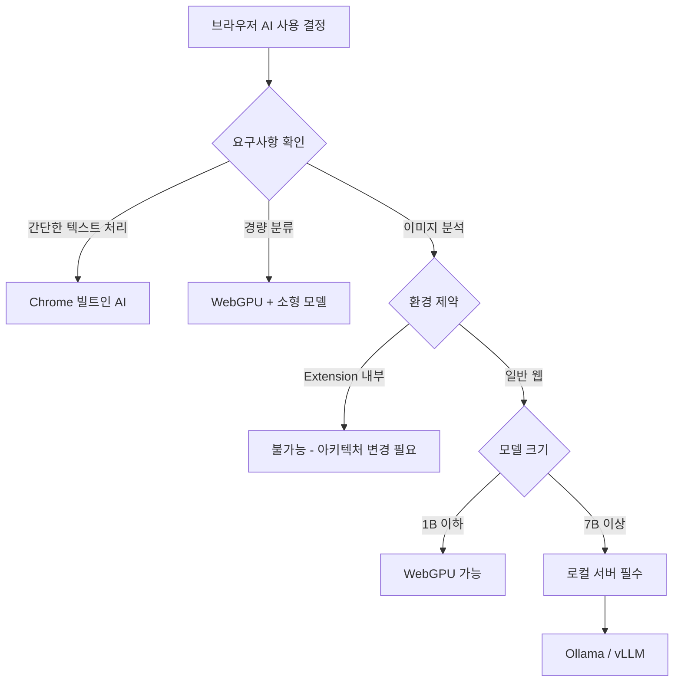

# 브라우저 AI에서 Ollama까지의 여정

## 개요

이 문서는 `ai-company-analyzer` 프로젝트에서 AI 분석 기능을 구현하기 위해 거쳐간 수많은 시도와 실패를 기록합니다. 각 실패에서 배운 교훈이 최종 성공으로 이어졌습니다.

### 전체 타임라인



### 시도 요약

| 시도 | 기술 스택 | 결과 | 핵심 문제 |
|------|----------|------|----------|
| 1 | WebLLM + ViT-GPT2 | 실패 | 2단계 파이프라인 복잡, 정보 손실 |
| 2 | SmolVLM-500M | 실패 | 한글 미지원, 프롬프트 에코 |
| 3 | Qwen2-VL-2B | 실패 | Service Worker 동적 import 금지 |
| 4 | 임베딩/RAG | 실패 | ONNX Runtime 호환성 문제 |
| 5 | Tesseract + Qwen3-0.6B | 실패 | 메모리 제약, 품질 한계 |
| 6 | Ollama | 성공 | 7B+ Vision 모델 사용 가능 |

---

## Phase 1: Extension-only 아키텍처

처음에는 모든 AI 처리를 Chrome Extension 내에서 수행하려 했습니다.

### 시도 1: WebLLM + ViT-GPT2

**아이디어**: 텍스트와 이미지를 분리하여 처리

```
[기존 파이프라인]
이미지 → Transformers.js (ViT-GPT2 캡셔닝) → 캡션 텍스트
                                              ↓
텍스트 → WebLLM (Qwen2-1.5B) ←────────────────┘
                    ↓
               분석 결과
```

**문제점**:
- 2단계 파이프라인으로 정보 손실 발생
- 이미지 → 캡션 변환 시 중요 정보 누락
- DOM 텍스트 추출이 뒤죽박죽

**참조**: `docs/extension-only/fix/01-smolvlm-migration.md`

---

### 시도 2: SmolVLM-500M

**아이디어**: Vision LLM으로 이미지 직접 분석

```
[새 파이프라인]
이미지 → SmolVLM-500M-Instruct → 분석 결과 (단일 단계)
```

**왜 SmolVLM을 선택했는가**:
- 500M 파라미터로 브라우저에서 실행 가능
- MacBook M1/M2에서 2-3k tokens/sec
- Vision LLM이므로 캡셔닝 단계 불필요

**실패 원인: 한글 미지원**

```
증상: JSON 파싱 실패
응답: "이 그래프/차트 이미지를 분석하고 JSON 형식으로 응답하세요.
      이 그래프/차트 이미지를 분석하고 JSON 형식으로 응답하세요.
      이 그래프/차트 이미지를 분석하고 JSON 형식으로 응답하세요."

→ 모델이 이미지를 분석하지 못하고 프롬프트를 그대로 반복 출력
```

| 문제 | 설명 |
|------|------|
| 한글 미지원 | SmolVLM 시리즈는 영어 전용 모델 |
| 프롬프트 에코 | 이해하지 못하면 입력을 반복 |
| OCR 불가 | 한글 텍스트 인식 실패 |

**참조**: `docs/extension-only/fix/02-qwen2vl-migration.md`

---

### 시도 3: Qwen2-VL-2B

**아이디어**: 한글 지원 Vision 모델로 교체

| 항목 | SmolVLM-500M | Qwen2-VL-2B |
|------|--------------|-------------|
| 파라미터 | 500M | 2B |
| 한국어 | 미지원 | 지원 |
| 다국어 OCR | 미지원 | 19개 언어 |
| 메모리 | ~2GB | ~4GB |

**코드 변경**:
```typescript
// 변경 전
const MODEL_ID = 'HuggingFaceTB/SmolVLM-500M-Instruct';
model = await AutoModelForVision2Seq.from_pretrained(MODEL_ID, { device: 'webgpu' });

// 변경 후
const MODEL_ID = 'onnx-community/Qwen2-VL-2B-Instruct';
model = await Qwen2VLForConditionalGeneration.from_pretrained(MODEL_ID, { device: 'webgpu' });
```

**실패 원인: Service Worker 제약**

Chrome Extension MV3의 Service Worker에서는 동적 `import()`가 금지되어 있습니다:

```
Error: no available backend found.
ERR: [webgpu] TypeError: import() is disallowed on ServiceWorkerGlobalScope
```

**참조**: `docs/extension-only/fix/06-embedding-issue.md`

---

### 시도 4: Offscreen Document로 우회

**아이디어**: Service Worker 대신 Offscreen Document에서 AI 실행



**시도한 우회 방법들**:

| 시도 | 설명 | 결과 |
|------|------|------|
| WASM 로컬 번들링 | CDN 의존성 제거 | 동적 import 문제 지속 |
| Offscreen Document | Service Worker 분리 | 동일 오류 발생 |
| ONNX 환경 설정 | `proxy: false`, 싱글 스레드 | 설정 적용 전 초기화 |
| `device: 'wasm'` | WebGPU 대신 WASM 강제 | 동일 오류 |

**근본 원인**:
- `@huggingface/transformers` v3은 내부적으로 `onnxruntime-web` 사용
- ONNX Runtime이 WASM 백엔드 초기화 시 동적 import 수행
- Service Worker 환경과 호환 불가

**관련 GitHub 이슈**:
- [microsoft/onnxruntime#20876](https://github.com/microsoft/onnxruntime/issues/20876)
- [huggingface/transformers.js#787](https://github.com/huggingface/transformers.js/issues/787)

**결론: 임베딩/RAG 제거**

```
[변경 전]
이미지 → 분류 → 텍스트추출 → 임베딩 → vectorIndex → 벡터검색 → LLM

[변경 후]
이미지 → 분류 → 텍스트추출 → metadata 수집 → LLM
```

벡터 임베딩 기반 RAG를 포기하고, 추출된 텍스트의 metadata를 직접 LLM 컨텍스트로 사용하는 방식으로 전환했습니다.

**참조**: `docs/extension-only/fix/07-embedding-removed.md`

---

## Phase 2: SPA 분리 아키텍처

Extension의 Service Worker 제약을 피하기 위해 아키텍처를 변경했습니다.

### 아키텍처 변경

```
[기존: Extension-only]
Extension(Service Worker) → transformers.js → AI 분석

[변경: SPA + Extension]
Extension → 데이터 저장만
SPA (일반 웹페이지) → AI 분석
```

**왜 SPA를 분리했는가**:
- 일반 웹페이지에서는 동적 import 가능
- WebGPU 사용 가능
- 복잡한 UI 구현 용이

---

### 시도 5: Tesseract.js + Qwen3-0.6B

**아이디어**: OCR + 소형 LLM 조합

```
[파이프라인]
이미지 → Tesseract.js (OCR) → 텍스트 → Qwen3-0.6B → 분석 결과
```

| 기술 | 역할 |
|------|------|
| Tesseract.js v6 | 이미지에서 텍스트 추출 |
| transformers.js v3 | 브라우저용 ML 추론 |
| Qwen3-0.6B | 텍스트 분석 |
| WebGPU | GPU 가속 |

**실패 원인들**:

#### 1. 메모리 제약

```
브라우저 환경:
- GPU 메모리 공유로 대형 모델 불가
- fp32 모델은 ">4GB WebAssembly memory" 제한
- 메모리 누수 (WebGPU 텐서 미해제)
```

| 문제 | 증상 |
|------|------|
| 메모리 부족 | out-of-memory 크래시 |
| 장치 손실 | "device is lost" 에러 |
| 메모리 누수 | 사용량 계속 증가 |

#### 2. 모델 품질 한계

0.5B~1B 파라미터 모델만 안정적으로 실행 가능:
- 복잡한 추론 능력 부족
- 한국어 이해도 낮음
- 이미지 분류 정확도 불충분

#### 3. 브라우저 호환성

```
WebGPU 지원 현황 (2024):
- Chrome: 지원
- Firefox: 미지원
- Safari: 미지원
- 전체 사용자의 ~70%만 사용 가능
```

---

### 시도 6: Ollama (최종 성공)

**아이디어**: 브라우저 제약을 벗어나 로컬 서버 활용



**왜 성공했는가**:

| 항목 | 브라우저 AI | Ollama |
|------|------------|--------|
| 모델 크기 | 0.5B~1B | 7B~90B |
| Vision 지원 | 제한적 | 완전 지원 |
| 메모리 | 공유 제한 | 전용 VRAM |
| 안정성 | 불안정 | 안정적 |

**핵심 이점**:

1. **대형 모델 사용 가능**
   - Qwen2-VL 7B, LLaVA 13B, Llama 3.2 Vision 11B/90B
   - 품질 차이가 극적

2. **Vision 모델 직접 지원**
   - OCR 불필요: 이미지 → Vision LLM → 분석 (단일 단계)
   - Tesseract.js 제거로 파이프라인 단순화

3. **로컬 실행 장점**
   - 프라이버시: 데이터가 외부로 전송되지 않음
   - 비용: API 호출 비용 없음
   - 오프라인: 인터넷 없이 동작

---

## 최종 아키텍처



---

## 교훈 및 정리

### 실패에서 배운 것

| 실패 | 교훈 |
|------|------|
| SmolVLM 한글 미지원 | 다국어 지원은 필수 요구사항으로 확인 |
| Service Worker 제약 | Chrome MV3 환경의 기술적 한계 인지 |
| 임베딩 실패 | 라이브러리 호환성 사전 검증 필요 |
| 0.5B 품질 한계 | 브라우저 AI는 간단한 작업에만 적합 |

### 기술 선택 가이드



### 핵심 교훈

1. **브라우저 환경의 한계를 인정하라**
   - GPU 메모리 공유, 4GB WASM 제한, 동적 import 금지 등 근본적 제약
   - 무리하게 브라우저에서 실행하려다 품질과 안정성 희생

2. **요구사항에 맞는 도구를 선택하라**
   - 이미지 분석 + 한국어 + 높은 정확도 = 대형 Vision 모델 필수
   - 개인 프로젝트라면 Ollama 같은 로컬 솔루션이 현실적

3. **점진적으로 검증하라**
   - 처음부터 완벽한 솔루션은 없음
   - 빠른 프로토타이핑으로 한계를 조기에 파악

4. **아키텍처 변경을 두려워하지 마라**
   - Extension-only → SPA 분리로 문제 해결
   - 근본적 제약을 우회하기 위해 과감한 변경 필요

---

## 참고 자료

### 프로젝트 내부 문서
- `docs/extension-only/fix/01-smolvlm-migration.md` - SmolVLM 마이그레이션
- `docs/extension-only/fix/02-qwen2vl-migration.md` - Qwen2-VL 마이그레이션
- `docs/extension-only/fix/06-embedding-issue.md` - 임베딩 실패 분석
- `docs/extension-only/fix/07-embedding-removed.md` - 임베딩 제거
- `docs/spa-with-extension/fix/ollama/00-overview.md` - Ollama 전환

### 외부 자료
- [Chrome Built-in AI APIs](https://developer.chrome.com/docs/ai/built-in-apis)
- [Transformers.js Documentation](https://huggingface.co/docs/transformers.js)
- [WebGPU bugs | Medium](https://medium.com/@marcelo.emmerich/webgpu-bugs-are-holding-back-the-browser-ai-revolution-27d5f8c1dfca)
- [Ollama Vision Models](https://ollama.com/blog/vision-models)
- [onnxruntime#20876](https://github.com/microsoft/onnxruntime/issues/20876) - Service Worker 이슈

---

## 관련 문서

- [Ollama API 통합](./06-ollama-integration.md) - 현재 구현 상세
- [스트리밍 아키텍처](./02-streaming-architecture.md) - Ollama 스트리밍 처리
- [Extension-SPA 통신](./07-extension-spa-communication.md) - 전체 아키텍처
