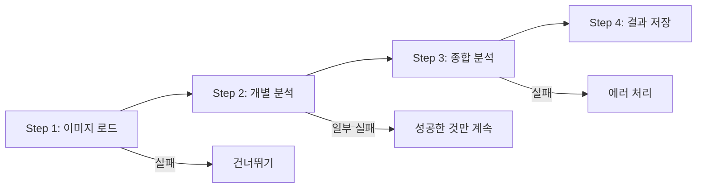
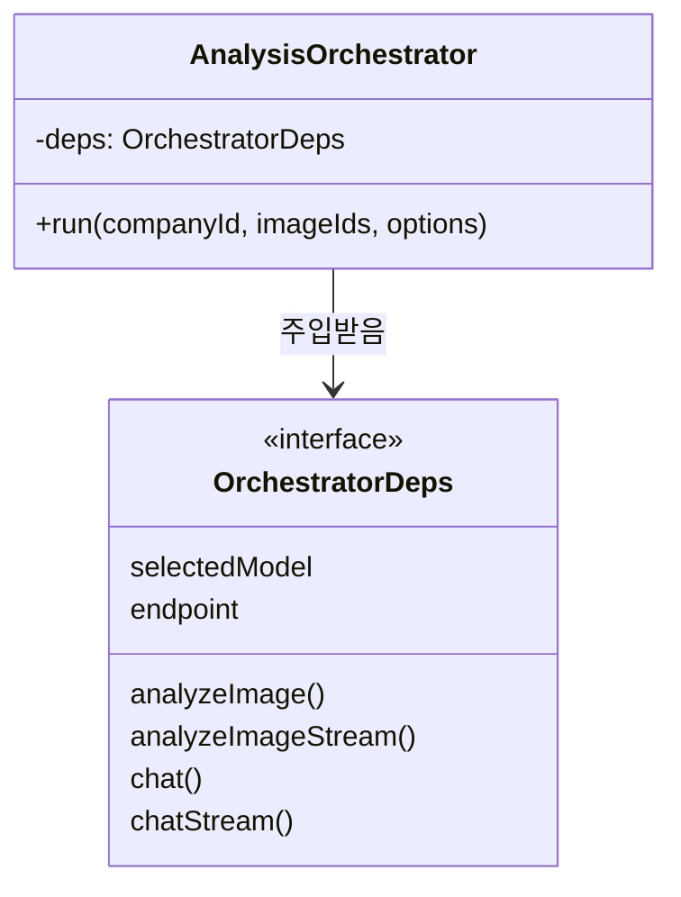
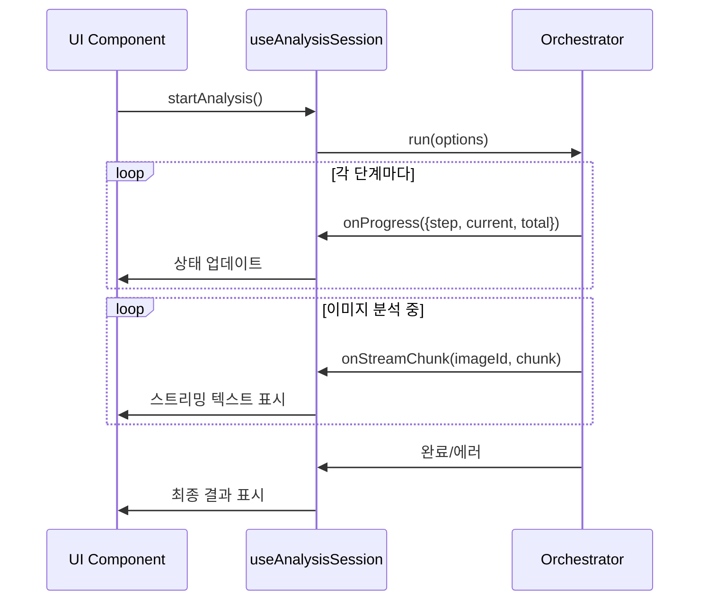
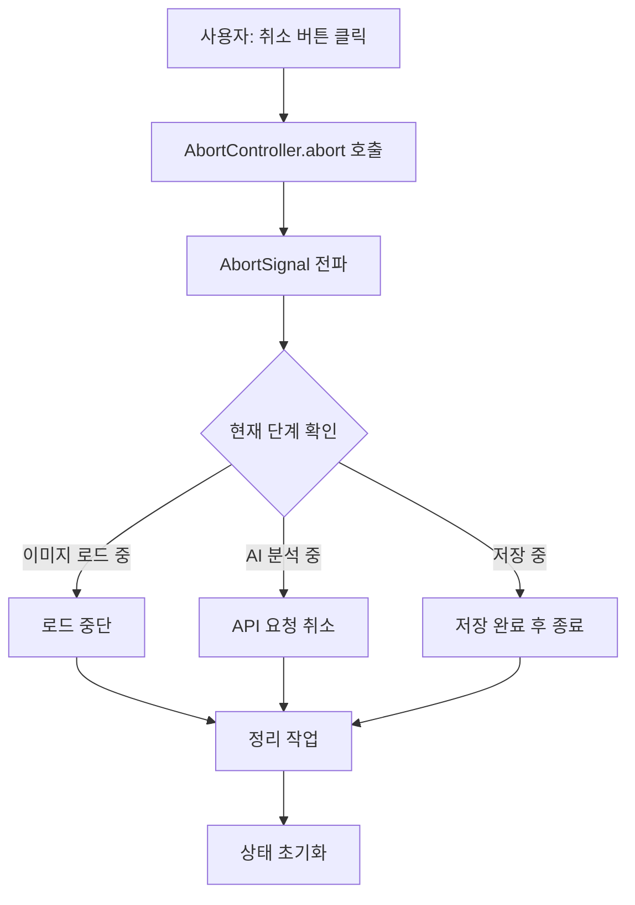

# Orchestrator 패턴

## 개요

Orchestrator 패턴은 복잡한 다단계 작업을 조율하는 설계 패턴입니다. 이 프로젝트에서는 AI 이미지 분석 파이프라인을 관리하는 데 사용됩니다.

**참조 파일**: `spa/src/lib/analysis/orchestrator.ts`

## 왜 필요한가?

AI 분석 작업은 단순한 API 호출이 아닙니다:

1. 여러 이미지를 로드하고 최적화해야 함
2. 각 이미지를 개별적으로 AI 분석해야 함
3. 개별 분석 결과를 종합하여 최종 평가를 생성해야 함
4. 모든 결과를 데이터베이스에 저장해야 함

이 모든 단계가:
- 순차적으로 실행되어야 하고
- 중간에 취소될 수 있어야 하고
- 일부 실패해도 계속 진행해야 하고
- 진행 상황을 실시간으로 보여줘야 합니다

## 핵심 개념

### 1. 4단계 파이프라인



각 단계는 독립적으로 실패할 수 있으며, 가능한 한 많은 작업을 완료하려고 합니다.

### 2. 의존성 주입 (Dependency Injection)

Orchestrator는 필요한 함수들을 외부에서 주입받습니다:



**왜 DI를 사용하는가?**
- **테스트 용이성**: 실제 AI API 대신 mock을 주입할 수 있음
- **유연성**: Ollama 대신 다른 AI 서비스로 교체 가능
- **관심사 분리**: Orchestrator는 "흐름"만 관리, "구현"은 알지 못함

### 3. 콜백 기반 진행 상태 추적



## 설계 원칙

### 에러 격리 (Error Isolation)

하나의 이미지 분석이 실패해도 다른 이미지는 계속 분석합니다:

```
이미지 1: 성공 ✓
이미지 2: 실패 ✗ → 건너뛰고 계속
이미지 3: 성공 ✓
이미지 4: 성공 ✓
→ 3개의 결과로 종합 분석 진행
```

**핵심 아이디어**: 부분적 성공이 전체 실패보다 낫다

### Graceful Shutdown (AbortSignal)

사용자가 분석을 취소하면:



AbortSignal을 파이프라인 전체에 전달하여 어느 단계에서든 깔끔하게 중단할 수 있습니다.

### 진행 상태 구조화

```typescript
interface StepProgress {
  step: 'loading-images' | 'analyzing' | 'synthesizing' | 'saving' | 'done' | 'error';
  current: number;      // 현재 처리 중인 항목 번호
  total: number;        // 전체 항목 수
  message: string;      // 사용자에게 표시할 메시지
  currentImageId?: string;  // 스트리밍 시 현재 이미지 ID
}
```

## 활용 사례

이 패턴은 다음과 같은 상황에서 유용합니다:

1. **여러 API를 순차 호출해야 할 때**
2. **부분 실패를 허용해야 할 때**
3. **긴 작업의 진행 상황을 보여줘야 할 때**
4. **작업을 중간에 취소할 수 있어야 할 때**

## 관련 문서

- [스트리밍 아키텍처](./02-streaming-architecture.md) - 개별 분석/종합 분석의 스트리밍 처리
- [React 스트리밍 최적화](./05-react-streaming-optimization.md) - UI에서 진행 상태 표시 최적화
