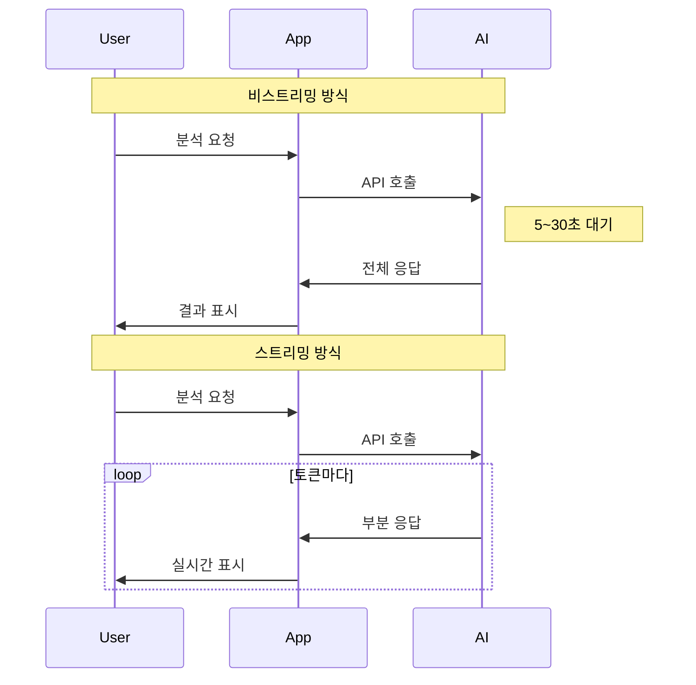
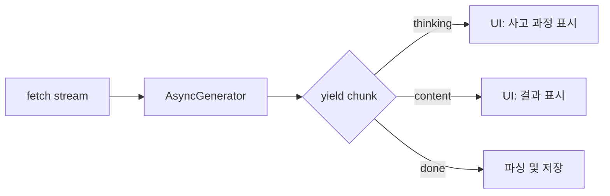
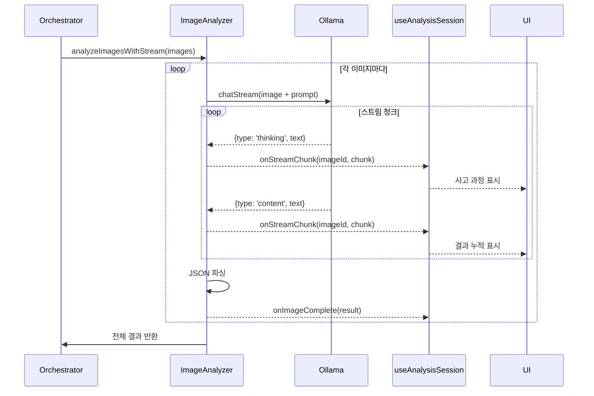
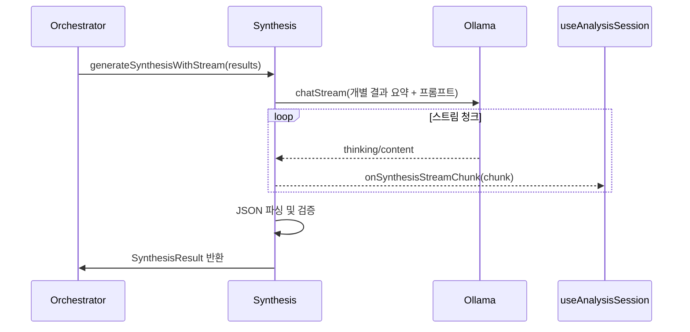

# 스트리밍 아키텍처

## 개요

AI 모델의 응답을 실시간으로 처리하여 사용자에게 즉각적인 피드백을 제공하는 아키텍처입니다.

**참조 파일**:
- `spa/src/lib/analysis/image-analyzer.ts`
- `spa/src/lib/analysis/synthesis.ts`

## 왜 스트리밍인가?

### 비스트리밍 vs 스트리밍



| 방식 | 장점 | 단점 |
|------|------|------|
| 비스트리밍 | 구현 간단, Structured Output 지원 | 오래 기다려야 함, UX 저하 |
| 스트리밍 | 즉각적 피드백, thinking 과정 가시화 | 구현 복잡, JSON 파싱 어려움 |

## 핵심 개념

### 1. thinking과 content 분리

Qwen 같은 thinking 모델은 두 가지 출력을 생성합니다:

```
┌─────────────────────────────────────────┐
│ thinking (사고 과정)                      │
│ "이 이미지는 회사 채용 페이지로 보입니다.  │
│  복지 정보가 포함되어 있으니 welfare로...  │
└─────────────────────────────────────────┘
                    ↓
┌─────────────────────────────────────────┐
│ content (최종 응답)                       │
│ {"category": "welfare", "summary": ...}  │
└─────────────────────────────────────────┘
```

스트리밍 시 이 둘을 분리하여 처리해야 합니다:
- **thinking**: 사용자에게 AI가 "생각 중"임을 보여줌
- **content**: 실제 JSON 결과를 파싱하여 저장

### 2. AsyncGenerator 패턴

JavaScript의 AsyncGenerator를 활용하여 스트리밍을 추상화합니다:



**AsyncGenerator의 장점**:
- `for await...of`로 자연스럽게 순회 가능
- 생산자(AI)와 소비자(UI)의 비동기 처리 분리
- 에러 핸들링이 try-catch로 가능

### 3. Structured Output vs 프롬프트 유도

**문제**: Ollama의 `format: 'json'` 옵션은 thinking과 충돌합니다.

```
format: 'json' 사용 시:
- thinking 없이 바로 JSON 출력
- 사고 과정 가시화 불가

format 없이 프롬프트 유도:
- thinking + content 모두 출력
- 프롬프트에서 JSON 형식 강제
```

**해결 방법**: format 파라미터를 사용하지 않고, 프롬프트에서 JSON 형식을 명시적으로 요청합니다.

## 스트리밍 흐름

### 이미지 분석 스트리밍



### 종합 분석 스트리밍



## 설계 결정

### 에러 처리 전략

스트리밍 중 에러가 발생할 수 있는 시점:
1. **네트워크 에러**: fetch 연결 끊김
2. **파싱 에러**: JSON 형식이 잘못됨
3. **검증 에러**: 필수 필드 누락

각 에러는 개별 이미지 단위로 격리되어 다른 이미지 분석에 영향을 주지 않습니다.

### 스트림 버퍼링

멀티바이트 문자(한글 등)는 바이트 경계에서 잘릴 수 있습니다:

```
청크 1: "안녕하세" (불완전)
청크 2: "요" (나머지)
```

StreamBuffer를 사용하여 완전한 문자열이 될 때까지 버퍼링합니다.

## 두 가지 구현

이 프로젝트는 스트리밍과 비스트리밍 두 가지 구현을 모두 제공합니다:

| 함수 | 용도 |
|------|------|
| `analyzeImages()` | 빠른 분석, thinking 불필요 시 |
| `analyzeImagesWithStream()` | 사고 과정 가시화, 실시간 피드백 |
| `generateSynthesis()` | 빠른 종합 분석 |
| `generateSynthesisWithStream()` | 종합 분석 과정 가시화 |

사용자 설정에 따라 선택 가능합니다.

## 관련 문서

- [스트림 파싱 기법](./04-stream-parsing.md) - JSON 추출 및 멀티바이트 처리
- [React 스트리밍 최적화](./05-react-streaming-optimization.md) - UI 업데이트 최적화
- [Orchestrator 패턴](./01-orchestrator-pattern.md) - 스트리밍을 포함한 전체 흐름
