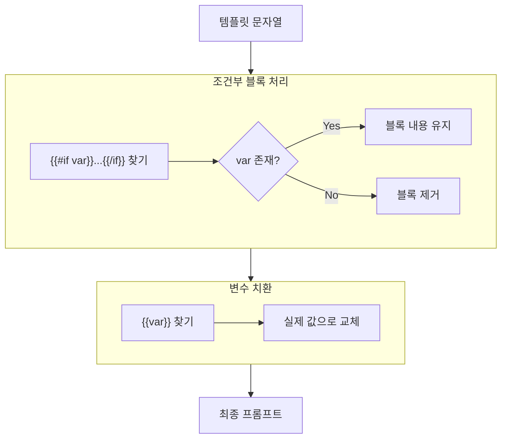

# 프롬프트 템플릿 시스템

## 개요

사용자가 커스터마이징할 수 있는 유연한 프롬프트 관리 시스템입니다. Handlebars와 유사한 문법을 사용합니다.

**참조 파일**: `spa/src/lib/prompts/`

## 왜 템플릿 시스템인가?

### 하드코딩의 문제

```
"당신은 회사 분석 전문가입니다.
 다음 이미지를 분석해주세요.
 회사명: ABC Company"
```

**문제점**:
- 회사명을 바꾸려면 코드를 수정해야 함
- 다국어 지원 어려움
- 사용자가 프롬프트를 조정할 수 없음

### 템플릿의 해결책

```
"당신은 회사 분석 전문가입니다.
 다음 이미지를 분석해주세요.
 회사명: {{companyName}}"
```

변수를 분리하여 코드 변경 없이 다양한 상황에 대응합니다.

## 템플릿 문법

### 1. 변수 치환

```
{{변수명}}
```

**예시**:
```
회사명: {{companyName}}
분석 모델: {{modelName}}
```

### 2. 조건부 블록

```
{{#if 변수명}}
  조건이 참일 때 표시될 내용
{{/if}}
```

**예시**:
```
{{#if memo}}
이 이미지에 대한 추가 정보:
{{memo}}
{{/if}}
```

변수가 존재하고 빈 문자열이 아닐 때만 블록 내용이 포함됩니다.

## 동작 원리

### 보간 프로세스



### 정규표현식 기반 구현

두 가지 패턴을 순차적으로 적용합니다:

1. **조건부 블록**: `{{#if varName}}...{{/if}}`
2. **변수 치환**: `{{varName}}`

순서가 중요합니다. 조건부 블록을 먼저 처리해야 블록 내부의 변수도 올바르게 치환됩니다.

## 프롬프트 구조

### 이미지 분석 프롬프트

```
┌─────────────────────────────────────┐
│ 역할 정의                            │
│ "당신은 기업 분석 전문가입니다..."     │
├─────────────────────────────────────┤
│ 컨텍스트                             │
│ "회사명: {{companyName}}"            │
│ "{{#if memo}}메모: {{memo}}{{/if}}"  │
├─────────────────────────────────────┤
│ 작업 지시                            │
│ "이미지를 분석하고 다음 형식으로..."    │
├─────────────────────────────────────┤
│ 출력 형식 (JSON 스키마)               │
│ {category, summary, details, ...}   │
└─────────────────────────────────────┘
```

### 종합 분석 프롬프트

```
┌─────────────────────────────────────┐
│ 역할 정의                            │
│ "당신은 채용 분석 전문가입니다..."     │
├─────────────────────────────────────┤
│ 입력 데이터                          │
│ "회사명: {{companyName}}"            │
│ "{{#if context}}컨텍스트: ...{{/if}}" │
│ "개별 분석 결과: {{analyses}}"        │
├─────────────────────────────────────┤
│ 평가 기준                            │
│ "점수 산정 기준..."                   │
├─────────────────────────────────────┤
│ 출력 형식                            │
│ {score, summary, strengths, ...}    │
└─────────────────────────────────────┘
```

## 설계 원칙

### 기본값 제공

모든 템플릿에는 잘 작동하는 기본값이 있습니다:
- 사용자가 커스터마이징하지 않으면 기본값 사용
- 기본값은 충분히 테스트되어 안정적

### 변수명 명시

프롬프트에서 사용 가능한 변수를 문서화합니다:

| 변수명 | 설명 | 필수 |
|--------|------|------|
| `companyName` | 분석 대상 회사명 | O |
| `memo` | 이미지별 메모 | X |
| `context` | 회사 분석 컨텍스트 | X |
| `analyses` | 개별 분석 결과 요약 | O (종합 분석) |

### JSON 형식 강제

프롬프트 마지막에 JSON 형식을 명시적으로 요청합니다:

```
반드시 아래 JSON 형식으로만 응답하세요:
{
  "category": "welfare | culture | work-environment | ...",
  "summary": "한 줄 요약",
  ...
}
```

이렇게 하면 format 파라미터 없이도 구조화된 응답을 유도할 수 있습니다.

## 확장 가능성

### 새 변수 추가

1. AnalysisOptions에 새 필드 추가
2. interpolatePrompt 호출 시 변수 객체에 포함
3. 기본 템플릿에 사용 예시 추가

### 다국어 지원

템플릿 자체를 다국어로 관리할 수 있습니다:

```
프롬프트 (한국어): "회사명: {{companyName}}"
프롬프트 (영어): "Company: {{companyName}}"
```

## 관련 문서

- [스트리밍 아키텍처](./02-streaming-architecture.md) - 프롬프트로 JSON 형식 유도
- [Orchestrator 패턴](./01-orchestrator-pattern.md) - 프롬프트 옵션 전달 방법
