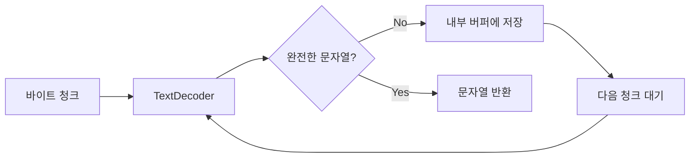
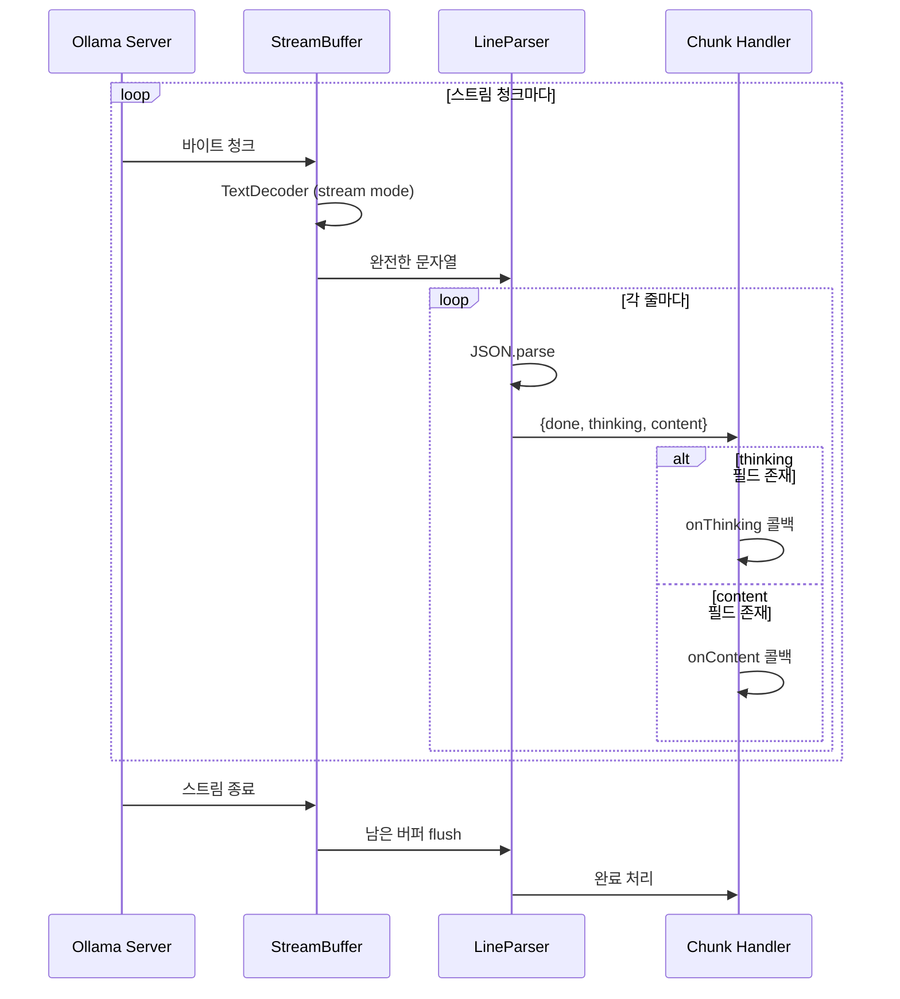
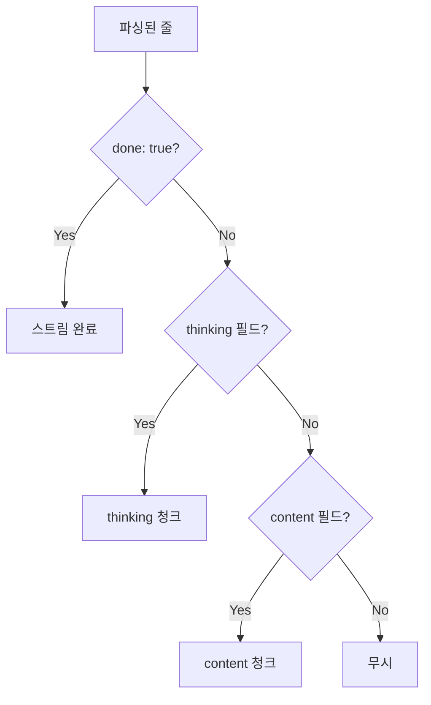

# 스트림 파싱 기법

## 개요

AI 스트리밍 응답에서 JSON을 안전하게 추출하고, 멀티바이트 문자를 올바르게 처리하는 기법입니다.

**참조 파일**: `spa/src/lib/ai/stream-parser.ts`

## 왜 특별한 파싱이 필요한가?

### 문제 1: AI 응답이 항상 깨끗한 JSON이 아님

```
AI 응답 예시 1:
"분석 결과입니다:
```json
{"category": "welfare", "summary": "..."}
```
"

AI 응답 예시 2:
{"category": "welfare", "summary": "..."}

AI 응답 예시 3:
"네, 분석해드리겠습니다. {"category": "welfare"...}"
```

다양한 형식을 모두 처리해야 합니다.

### 문제 2: 스트리밍 청크가 바이트 경계에서 잘림

```
원본: "안녕하세요"
UTF-8 바이트: [EC 95 88] [EB 85 95] [ED 95 98] [EC 84 B8] [EC 9A 94]

청크 1: [EC 95 88 EB 85] (불완전 - "안" + "녕"의 일부)
청크 2: [95 ED 95 98 EC] (불완전)
```

바이트 경계를 고려하지 않으면 한글이 깨집니다.

## 핵심 개념

### 1. 5단계 로버스트 JSON 추출

```mermaid
flowchart TD
    A[AI 응답 텍스트] --> B{Step 1: 코드블록?}
    B -->|Yes| C["```json...``` 추출"]
    B -->|No| D{Step 2: 일반블록?}
    D -->|Yes| E["```...``` 추출"]
    D -->|No| F{Step 3: 직접 파싱?}
    F -->|Yes| G[JSON.parse 시도]
    F -->|No| H{Step 4: 패턴 매칭?}
    H -->|Yes| I["첫 {...} 추출"]
    H -->|No| J{Step 5: 줄 단위?}
    J -->|Yes| K[각 줄 JSON 시도]
    J -->|No| L[파싱 실패]

    C --> M[결과 반환]
    E --> M
    G --> M
    I --> M
    K --> M
```

각 단계가 실패하면 다음 단계로 넘어갑니다. 어떤 형식의 응답이든 최대한 JSON을 추출합니다.

### 2. NDJSON (Newline Delimited JSON) 파싱

스트리밍 응답은 줄 단위로 JSON이 도착합니다:

```
{"done":false,"message":{"content":"안"}}
{"done":false,"message":{"content":"녕"}}
{"done":true,"message":{"content":""}}
```

각 줄을 독립적으로 파싱하여 처리합니다.

### 3. StreamBuffer

멀티바이트 문자의 안전한 처리를 위한 버퍼입니다.



**핵심**: TextDecoder의 `stream: true` 옵션으로 불완전한 시퀀스를 버퍼링합니다.

## 스트리밍 파싱 흐름

### 전체 파이프라인



### 청크 타입 분류



## 설계 결정

### 왜 정규표현식 기반 추출인가?

AI 응답은 예측할 수 없습니다:
- 코드 블록으로 감쌀 수도 있고
- 설명과 함께 JSON을 줄 수도 있고
- 순수 JSON만 줄 수도 있음

정규표현식으로 다양한 패턴을 순차적으로 시도하면 대부분의 경우를 커버할 수 있습니다.

### 왜 StreamBuffer가 필요한가?

HTTP 스트리밍은 바이트 경계와 문자 경계가 일치하지 않습니다. UTF-8에서 한글은 3바이트지만, 청크 경계가 중간에서 잘릴 수 있습니다.

TextDecoder의 stream 모드가 이를 해결합니다:
- 불완전한 바이트 시퀀스는 내부에 저장
- 다음 청크가 도착하면 결합하여 완전한 문자 생성

### 에러 복원력

```
라인 1: {"valid": "json"}  → 파싱 성공
라인 2: broken json        → 파싱 실패, 건너뛰기
라인 3: {"valid": "again"} → 파싱 성공
```

한 줄이 실패해도 다른 줄은 계속 처리합니다.

## 실제 사용 예

### thinking/content 분리

Qwen 같은 thinking 모델의 출력:

```json
{"message":{"content":"<think>이미지를 분석해보면...</think>"}}
{"message":{"content":"{"category":"welfare"..."}}
```

`<think>` 태그가 있으면 thinking으로, 없으면 content로 분류합니다.

### JSON 추출

스트림이 끝난 후 누적된 content에서 JSON 추출:

```
누적 content: "분석 결과입니다. {"category": "welfare", ...} 감사합니다."
             ↓ extractJsonFromContent()
JSON 객체: {"category": "welfare", ...}
```

## 관련 문서

- [스트리밍 아키텍처](./02-streaming-architecture.md) - 파싱된 청크의 활용
- [React 스트리밍 최적화](./05-react-streaming-optimization.md) - 파싱 결과의 UI 표시
