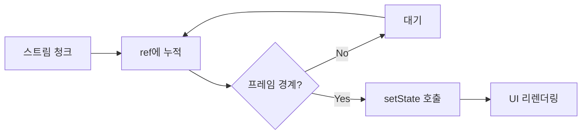
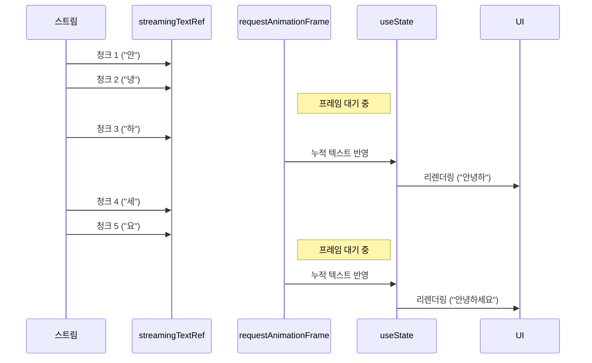
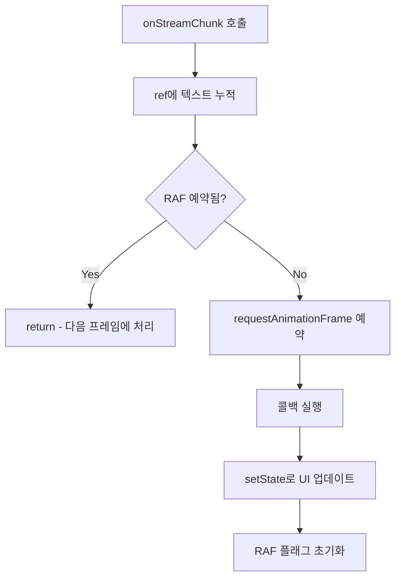
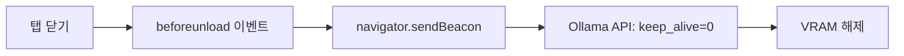

# React 스트리밍 최적화

## 개요

AI 스트리밍 응답을 React에서 효율적으로 표시하기 위한 성능 최적화 기법입니다.

**참조 파일**: `spa/src/hooks/useAnalysisSession.ts`

## 왜 최적화가 필요한가?

### 문제: 과도한 리렌더링

스트리밍 중에는 초당 수십~수백 개의 청크가 도착합니다:

```
청크 1: "안"
청크 2: "녕"
청크 3: "하"
청크 4: "세"
청크 5: "요"
...
```

각 청크마다 setState를 호출하면:
- React가 매번 리렌더링
- 60fps 화면 갱신 속도를 초과
- UI가 버벅거리고 배터리 소모 증가

### 해결 목표

```
입력: 초당 100+ 청크
출력: 초당 60회 이하 UI 업데이트 (1프레임당 1회)
```

## 핵심 개념

### 1. ref 기반 텍스트 누적



**핵심 아이디어**:
- `useRef`에 텍스트를 즉시 누적 (리렌더링 없음)
- 프레임 경계에서만 `useState`로 UI 업데이트

### 2. requestAnimationFrame throttle

브라우저의 화면 갱신 주기(보통 60Hz)에 맞춰 업데이트를 제한합니다:



### 3. 이중 버퍼링 구조

```
┌─────────────────────────────────────────┐
│ Layer 1: Ref (실시간)                    │
│ - streamingTextRef.thinking             │
│ - streamingTextRef.content              │
│ - 모든 청크 즉시 누적                     │
└─────────────────────────────────────────┘
                    ↓ 프레임 경계
┌─────────────────────────────────────────┐
│ Layer 2: State (UI 반영)                 │
│ - streaming.thinkingText                │
│ - streaming.contentText                 │
│ - 프레임당 1회 업데이트                   │
└─────────────────────────────────────────┘
```

## 구현 패턴

### 스트리밍 상태 구조

```typescript
interface StreamingState {
  currentImageId: string | null;
  phase: 'thinking' | 'content';
  thinkingText: string;
  contentText: string;
}

interface SynthesisStreamingState {
  isStreaming: boolean;
  thinkingText: string;
  contentText: string;
}
```

### RAF throttle 패턴



**핵심**: 여러 청크가 빠르게 도착해도 프레임당 한 번만 setState가 호출됩니다.

## 메모리 관리

### VRAM 해제: Beacon API

사용자가 탭을 닫으면 Ollama 모델이 VRAM에 계속 로드되어 있습니다.
`beforeunload` 이벤트에서 모델을 언로드합니다:



**왜 Beacon API인가?**
- `beforeunload`에서 일반 fetch는 취소될 수 있음
- Beacon은 페이지가 닫혀도 전송 보장
- 사용자 경험에 영향 없이 정리 작업 수행

### 상태 초기화

분석 완료/취소 시 모든 스트리밍 상태를 초기화:

```
resetSession() 호출:
├── isRunning = false
├── streaming = 초기값
├── synthesisStreaming = 초기값
├── ref 값들 초기화
└── RAF 핸들 취소
```

## 설계 결정

### 왜 ref와 state를 분리하는가?

| 접근 | 장점 | 단점 |
|------|------|------|
| state만 사용 | 구현 간단 | 과도한 리렌더링 |
| ref만 사용 | 리렌더링 없음 | UI 업데이트 안됨 |
| **ref + state** | 최적화된 업데이트 | 약간 복잡 |

### 왜 requestAnimationFrame인가?

| 방법 | 문제점 |
|------|--------|
| setTimeout | 타이밍이 화면 갱신과 안 맞음 |
| setInterval | 고정 주기가 비효율적 |
| **requestAnimationFrame** | 화면 갱신 주기에 최적화 |

RAF는 브라우저가 렌더링할 준비가 됐을 때만 콜백을 실행하므로, 불필요한 업데이트가 발생하지 않습니다.

## 스트리밍 상태 분리

### 이미지 분석 vs 종합 분석

```
이미지 분석 스트리밍:
├── 여러 이미지를 순차 처리
├── currentImageId로 현재 이미지 추적
└── 이미지마다 thinking/content 리셋

종합 분석 스트리밍:
├── 단일 스트림
├── 별도의 synthesisStreaming 상태
└── 이미지 분석과 독립적
```

두 스트리밍이 동시에 발생하지 않지만, 상태를 분리하면 코드가 명확해집니다.

## 관련 문서

- [스트리밍 아키텍처](./02-streaming-architecture.md) - 스트리밍 데이터 소스
- [스트림 파싱 기법](./04-stream-parsing.md) - 청크 파싱
- [Orchestrator 패턴](./01-orchestrator-pattern.md) - 전체 분석 흐름
