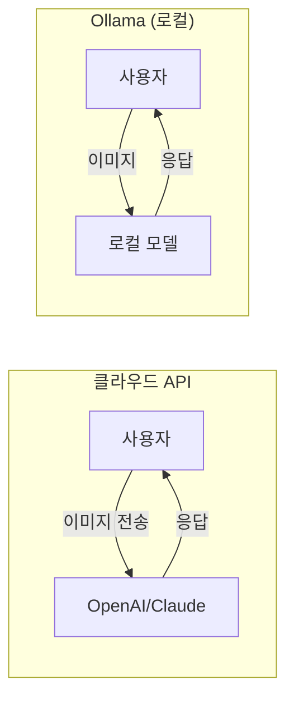
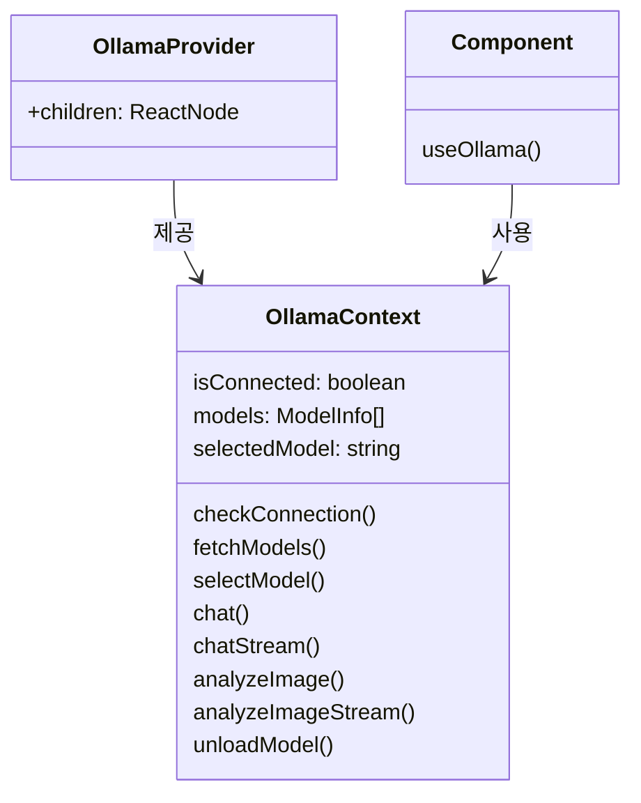
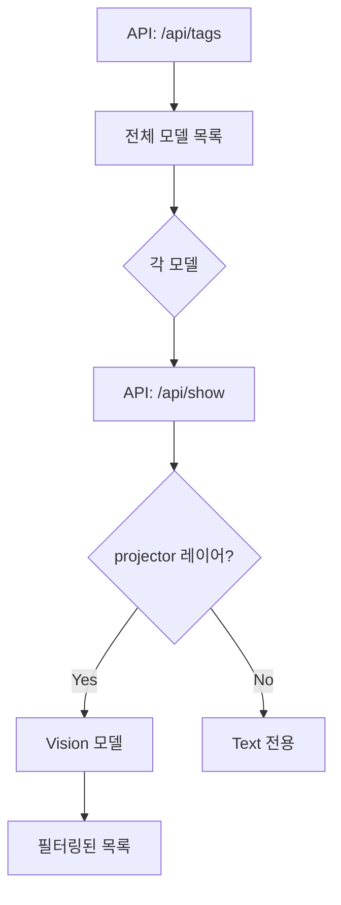
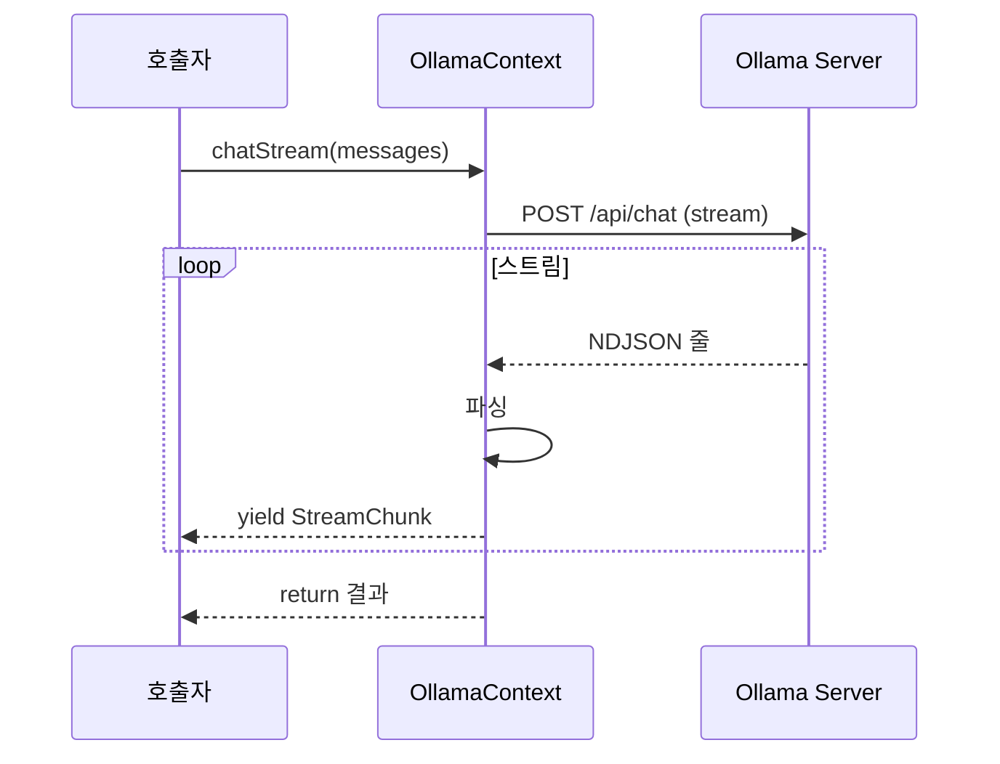
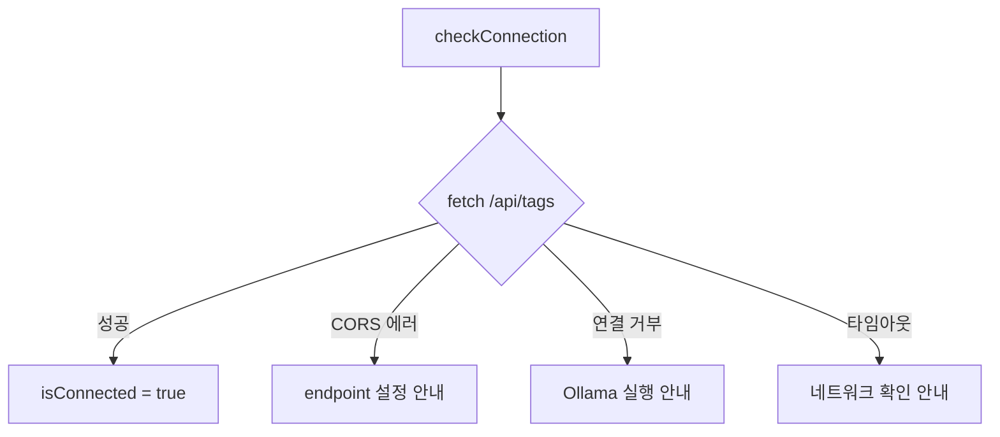

# Ollama API 통합

## 개요

로컬에서 실행되는 Ollama LLM 서버와 React 애플리케이션을 통합하는 방법입니다.

**참조 파일**: `spa/src/contexts/OllamaContext.tsx`

## 왜 Ollama인가?

### 로컬 LLM의 장점



| 항목 | 클라우드 API | Ollama |
|------|-------------|--------|
| 비용 | 토큰당 과금 | 무료 |
| 프라이버시 | 데이터 외부 전송 | 로컬 처리 |
| 속도 | 네트워크 지연 | GPU 성능에 의존 |
| 가용성 | 인터넷 필요 | 오프라인 가능 |

### Vision 모델 지원

이 프로젝트는 이미지 분석이 필요하므로 Vision 기능이 있는 모델만 필터링합니다:
- LLaVA
- Qwen2-VL
- Gemma2 Vision
- 등

## 핵심 개념

### 1. React Context로 클라이언트 추상화



모든 Ollama 관련 로직을 Context에 캡슐화하여:
- 컴포넌트가 Ollama API 세부사항을 알 필요 없음
- 연결 상태 전역 관리
- 모델 선택 상태 공유

### 2. 모델 Capabilities 확인

모든 모델이 Vision을 지원하지 않으므로 필터링합니다:



**Vision 모델 판별**: 모델 아키텍처에 `projector` 레이어가 있으면 이미지 처리 가능

### 3. keep_alive 옵션

Ollama 모델은 VRAM을 많이 사용합니다. `keep_alive` 옵션으로 메모리 관리:

```
keep_alive: "5m"   → 5분간 VRAM에 유지
keep_alive: "0"    → 즉시 언로드
keep_alive: "-1"   → 영구 로드
```

**전략**:
- 분석 중: 모델 유지
- 분석 완료: 일정 시간 후 자동 언로드
- 탭 닫기: 즉시 언로드

## API 구조

### 기본 API

```
POST /api/chat
└── 일반 채팅 (비스트리밍)

POST /api/chat (stream: true)
└── 스트리밍 채팅

POST /api/chat (images: [...])
└── Vision 분석
```

### 이미지 분석 요청 구조

```
{
  "model": "qwen2-vl:7b",
  "messages": [
    {
      "role": "user",
      "content": "이 이미지를 분석해주세요",
      "images": ["base64_encoded_image"]
    }
  ],
  "options": {
    "temperature": 0.3,
    "num_ctx": 8192
  },
  "stream": true
}
```

### 스트리밍 응답 형식 (NDJSON)

```
{"message":{"role":"assistant","content":"안"},"done":false}
{"message":{"role":"assistant","content":"녕"},"done":false}
{"message":{"content":"","done_reason":"stop"},"done":true}
```

## Context API 설계

### 상태 구조

```typescript
interface OllamaContextValue {
  // 연결 상태
  endpoint: string;
  isConnected: boolean;
  connectionError: string | null;

  // 모델 관리
  models: ModelInfo[];
  selectedModel: string | null;
  isLoadingModels: boolean;

  // 메서드
  checkConnection: () => Promise<boolean>;
  fetchModels: () => Promise<void>;
  selectModel: (modelName: string) => void;

  // 채팅 API
  chat: (messages: ChatMessage[]) => Promise<string>;
  chatStream: (messages: ChatMessage[]) => AsyncGenerator<StreamChunk>;

  // 이미지 분석 API
  analyzeImage: (image: string, prompt: string) => Promise<AnalysisResult>;
  analyzeImageStream: (image: string, prompt: string) => AsyncGenerator<StreamChunk>;

  // 리소스 관리
  unloadModel: () => Promise<void>;
}
```

### AsyncGenerator 스트리밍 패턴



**장점**:
- `for await...of`로 자연스러운 소비
- 에러는 자동으로 전파
- 취소는 AbortSignal로 처리

## 에러 처리

### 연결 에러



### 모델 에러

```
모델 없음 → 모델 다운로드 안내
Vision 미지원 → 다른 모델 선택 안내
VRAM 부족 → 작은 모델 권장
```

## 설정 관리

### 저장되는 설정

- `ollamaEndpoint`: 서버 주소 (기본: http://localhost:11434)
- `selectedModel`: 선택된 모델명

### 설정 저장 위치

Chrome Extension의 경우 `chrome.storage.sync`를 통해 저장되어 기기 간 동기화됩니다.

## 관련 문서

- [스트리밍 아키텍처](./02-streaming-architecture.md) - Ollama 스트리밍 활용
- [스트림 파싱 기법](./04-stream-parsing.md) - NDJSON 파싱
- [React 스트리밍 최적화](./05-react-streaming-optimization.md) - 응답 표시 최적화
