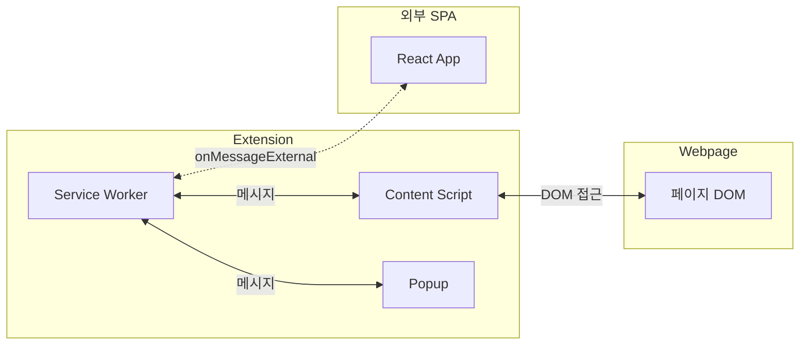
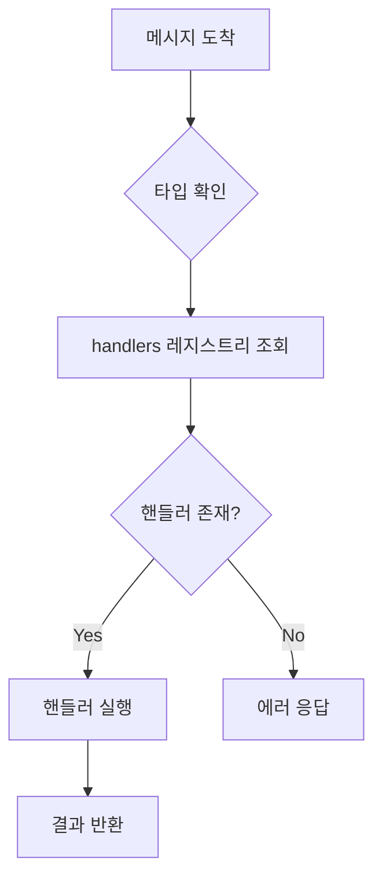
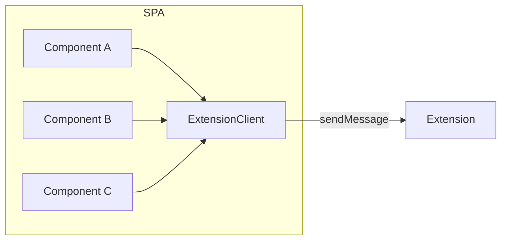
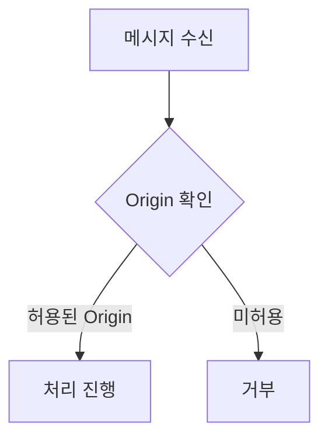
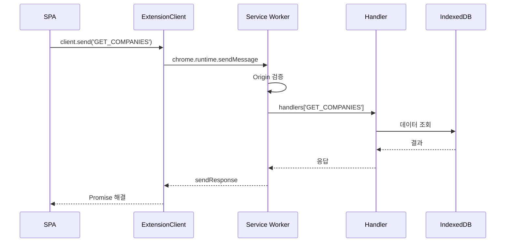
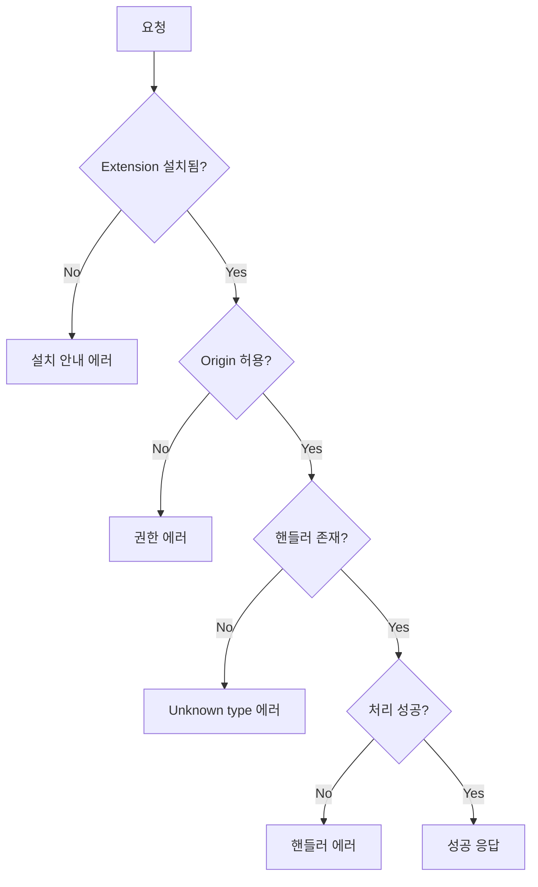

# Extension-SPA 메시지 통신

## 개요

Chrome Extension과 외부 SPA(Single Page Application) 간의 메시지 기반 통신 아키텍처입니다.

**참조 파일**:
- `extension/src/background/external-api.ts`
- `spa/src/lib/extension-client/`

## 왜 분리된 아키텍처인가?

### Chrome Extension의 제약



**제약사항**:
- Extension UI는 팝업(제한된 크기)이거나 옵션 페이지
- 복잡한 UI를 구현하기 어려움
- React 같은 프레임워크 사용이 번거로움

**해결책**: 데이터는 Extension에 저장하고, UI는 별도 SPA로 구현

### 통신 방식: onMessageExternal

Extension은 외부 웹페이지로부터 메시지를 받을 수 있습니다:

```
SPA (example.github.io)
    ↓ chrome.runtime.sendMessage(EXTENSION_ID, message)
Extension (Service Worker)
    ↓ chrome.runtime.onMessageExternal.addListener
메시지 처리
```

## 핵심 개념

### 1. 핸들러 레지스트리 패턴



메시지 타입별로 핸들러를 등록하는 패턴:

```
handlers = {
  'GET_COMPANIES': handleGetCompanies,
  'GET_IMAGES': handleGetImages,
  'SAVE_ANALYSIS': handleSaveAnalysis,
  ...
}
```

**장점**:
- 새 메시지 타입 추가가 쉬움
- 각 핸들러가 독립적
- 테스트하기 좋음

### 2. 싱글톤 클라이언트

SPA 측에서는 하나의 클라이언트 인스턴스를 공유합니다:



**왜 싱글톤인가?**:
- Extension ID 관리 중앙화
- 연결 상태 공유
- 불필요한 인스턴스 방지

### 3. Origin 검증

보안을 위해 허용된 출처만 메시지를 보낼 수 있습니다:



**허용 목록 예시**:
- `https://username.github.io`
- `http://localhost:5173` (개발 환경)

## 통신 흐름

### 요청-응답 패턴



### 에러 처리



## 응답 형식

### ApiResponse 래퍼

모든 응답은 통일된 형식을 따릅니다:

```typescript
type ApiResponse<T> =
  | { success: true; data: T }
  | { success: false; error: string; code?: ErrorCode }
```

**장점**:
- 성공/실패 명확히 구분
- 에러 정보 구조화
- 타입 추론 가능

## 핸들러 구조

### 핸들러 그룹화

```
handlers/
├── company-handlers.ts   # 회사 관련
│   ├── GET_COMPANIES
│   ├── GET_COMPANY
│   └── DELETE_COMPANY
├── image-handlers.ts     # 이미지 관련
│   ├── GET_IMAGES
│   ├── GET_IMAGE_DATA
│   └── DELETE_IMAGE
├── analysis-handlers.ts  # 분석 관련
│   ├── SAVE_ANALYSIS
│   ├── BATCH_SAVE_ANALYSIS
│   └── UPDATE_COMPANY_ANALYSIS
└── settings-handlers.ts  # 설정 관련
    └── GET/SET_SETTINGS
```

### 핸들러 등록 패턴

```typescript
// 핸들러 정의
export function registerCompanyHandlers(): void {
  registerHandler('GET_COMPANIES', async (payload) => {
    const companies = await db.companies.toArray();
    return companies.map(toCompanyDTO);
  });

  registerHandler('DELETE_COMPANY', async (payload) => {
    await db.companies.delete(payload.companyId);
    return { success: true };
  });
}

// 초기화 시 등록
initExternalApi();
registerCompanyHandlers();
registerImageHandlers();
// ...
```

## 설계 결정

### 왜 메시지 기반인가?

| 방식 | 장점 | 단점 |
|------|------|------|
| 직접 API | 단순 | Extension 컨텍스트 필요 |
| **메시지** | 격리, 보안 | 비동기 복잡 |
| SharedWorker | 실시간 | 브라우저 지원 제한 |

Chrome Extension의 Service Worker는 별도 컨텍스트에서 실행되므로 메시지 기반 통신이 유일한 방법입니다.

### 왜 핸들러 레지스트리인가?

**대안: switch 문**
```typescript
switch (message.type) {
  case 'GET_COMPANIES': ...
  case 'GET_IMAGES': ...
  // 파일이 점점 커짐
}
```

**핸들러 레지스트리**:
- 각 핸들러를 별도 파일로 분리 가능
- 새 타입 추가가 기존 코드 수정 없이 가능
- 테스트가 독립적

## 개발 시 고려사항

### 디버깅

```
Service Worker 로그: chrome://extensions → "서비스 워커" 링크
SPA 로그: 일반 DevTools Console
```

### CORS 설정

Extension이 외부 요청을 받으려면 manifest.json에 설정 필요:

```json
{
  "externally_connectable": {
    "matches": [
      "https://*.github.io/*",
      "http://localhost:*/*"
    ]
  }
}
```

## 관련 문서

- [타입 안전 메시지 프로토콜](./08-type-safe-messaging.md) - 메시지 타입 정의
- [React Query 패턴](./09-react-query-patterns.md) - SPA에서 메시지 활용
