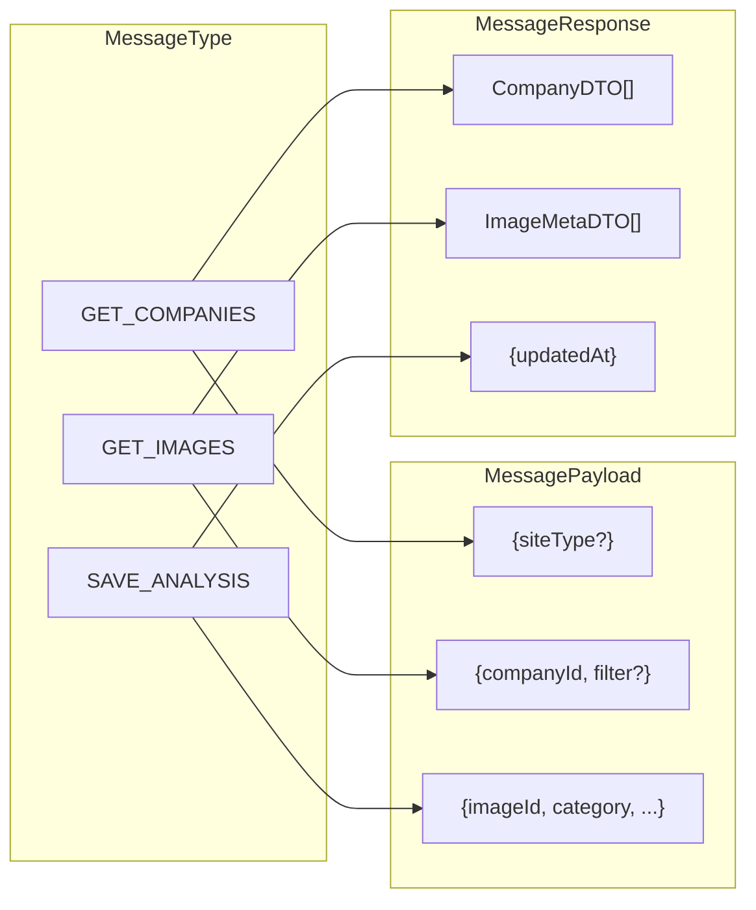
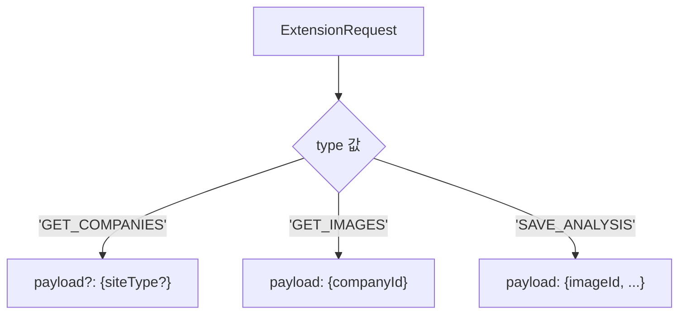
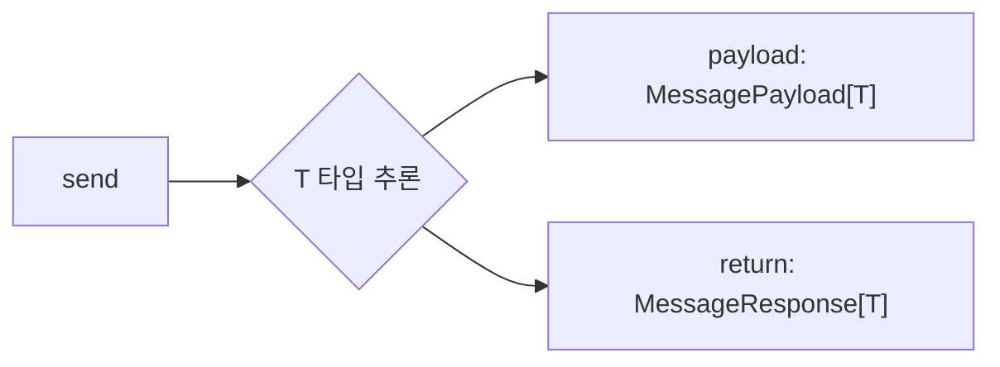

# 타입 안전 메시지 프로토콜

## 개요

컴파일 타임에 메시지 타입과 페이로드의 일관성을 보장하는 TypeScript 설계 패턴입니다.

**참조 파일**: `shared/types/messages.ts`

## 왜 타입 안전성이 중요한가?

### 문제: 런타임 에러

```typescript
// 타입 없이 메시지 보내기
client.send('GET_COMPANIES', { companyId: '123' });
// GET_COMPANIES는 companyId가 필요 없는데...
// 런타임에 발견되거나 조용히 무시됨
```

### 해결: 컴파일 타임 검증

```typescript
// 타입 있는 메시지 보내기
client.send('GET_COMPANIES', { companyId: '123' });
// ❌ 컴파일 에러: 'companyId'는 이 타입에 존재하지 않습니다
```

## 핵심 개념

### 1. MessagePayload와 MessageResponse 매핑



각 메시지 타입마다 정확한 페이로드와 응답 타입이 매핑됩니다.

### 2. Discriminated Union

TypeScript의 판별 유니온을 활용하여 타입을 알면 페이로드도 자동으로 결정됩니다:



**핵심**: `type` 필드의 값을 알면 TypeScript가 자동으로 `payload`의 타입을 추론합니다.

### 3. 제네릭 send 함수



함수 호출 시 타입 파라미터 `T`가 결정되면:
- 페이로드 타입이 자동 결정
- 반환 타입도 자동 결정

## 타입 정의 구조

### 1단계: 메시지 타입 정의

```typescript
type MessageType =
  | 'GET_COMPANIES'
  | 'GET_COMPANY'
  | 'DELETE_COMPANY'
  | 'GET_IMAGES'
  | 'SAVE_ANALYSIS'
  // ...
```

### 2단계: 페이로드 매핑

```typescript
interface MessagePayload {
  GET_COMPANIES: { siteType?: DataType } | undefined;
  GET_COMPANY: { companyId: string };
  DELETE_COMPANY: { companyId: string };
  GET_IMAGES: { companyId: string; filter?: ImageFilter };
  SAVE_ANALYSIS: {
    imageId: string;
    category: ImageSubCategory;
    rawText: string;
    analysis: string;
  };
  // ...
}
```

### 3단계: 응답 매핑

```typescript
interface MessageResponse {
  GET_COMPANIES: CompanyDTO[];
  GET_COMPANY: CompanyDetailDTO;
  DELETE_COMPANY: { success: boolean };
  GET_IMAGES: ImageMetaDTO[];
  SAVE_ANALYSIS: { updatedAt: string };
  // ...
}
```

### 4단계: 판별 유니온 생성

```typescript
type ExtensionRequest =
  | { type: 'GET_COMPANIES'; payload?: MessagePayload['GET_COMPANIES'] }
  | { type: 'GET_COMPANY'; payload: MessagePayload['GET_COMPANY'] }
  | { type: 'DELETE_COMPANY'; payload: MessagePayload['DELETE_COMPANY'] }
  // ...
```

## send 함수 시그니처

```typescript
function send<T extends MessageType>(
  type: T,
  payload?: MessagePayload[T]
): Promise<MessageResponse[T]>
```

**동작**:
1. `T`가 `'GET_COMPANIES'`로 추론되면
2. `payload`는 `{ siteType?: DataType } | undefined`로 제한
3. 반환 타입은 `Promise<CompanyDTO[]>`로 결정

## 실제 사용 예

### 올바른 사용

```typescript
// 페이로드 없이 호출
const companies = await client.send('GET_COMPANIES');
// companies: CompanyDTO[]

// 페이로드와 함께 호출
const images = await client.send('GET_IMAGES', {
  companyId: 'abc123'
});
// images: ImageMetaDTO[]

// 복잡한 페이로드
await client.send('SAVE_ANALYSIS', {
  imageId: 'img1',
  category: 'welfare',
  rawText: '...',
  analysis: '{...}'
});
```

### 컴파일 에러 예시

```typescript
// ❌ 필수 필드 누락
client.send('GET_IMAGES', {});
// Error: 'companyId' is required

// ❌ 잘못된 필드
client.send('GET_COMPANIES', { companyId: '123' });
// Error: 'companyId' does not exist on type

// ❌ 잘못된 타입
client.send('SAVE_ANALYSIS', { imageId: 123 });
// Error: number is not assignable to string
```

## 설계 이점

### 1. 컴파일 타임 검증

메시지 형식 오류를 배포 전에 발견합니다.

### 2. 자동 완성

IDE에서 사용 가능한 메시지 타입과 필요한 필드를 자동 완성합니다.

### 3. 리팩토링 안전성

메시지 타입이나 페이로드를 변경하면 관련된 모든 코드에서 에러가 표시됩니다.

### 4. 문서화 효과

타입 정의 자체가 API 문서 역할을 합니다.

## 새 메시지 타입 추가 방법

```typescript
// 1. MessageType에 추가
type MessageType = ... | 'NEW_MESSAGE';

// 2. MessagePayload에 추가
interface MessagePayload {
  // ...
  NEW_MESSAGE: { field1: string; field2: number };
}

// 3. MessageResponse에 추가
interface MessageResponse {
  // ...
  NEW_MESSAGE: { result: boolean };
}

// 4. (선택) ExtensionRequest 유니온에 추가
type ExtensionRequest = ...
  | { type: 'NEW_MESSAGE'; payload: MessagePayload['NEW_MESSAGE'] }
```

## ApiResponse 래퍼

모든 응답은 성공/실패를 구분하는 래퍼로 감싸집니다:

```typescript
type ApiResponse<T> =
  | { success: true; data: T }
  | { success: false; error: string; code?: ErrorCode }
```

**Discriminated Union 활용**:

```typescript
const response = await client.send('GET_COMPANIES');

if (response.success) {
  // response.data는 CompanyDTO[]로 추론됨
  console.log(response.data[0].name);
} else {
  // response.error는 string으로 추론됨
  console.error(response.error);
}
```

## 관련 문서

- [Extension-SPA 통신](./07-extension-spa-communication.md) - 메시지 전송 구현
- [React Query 패턴](./09-react-query-patterns.md) - 타입 안전 쿼리
