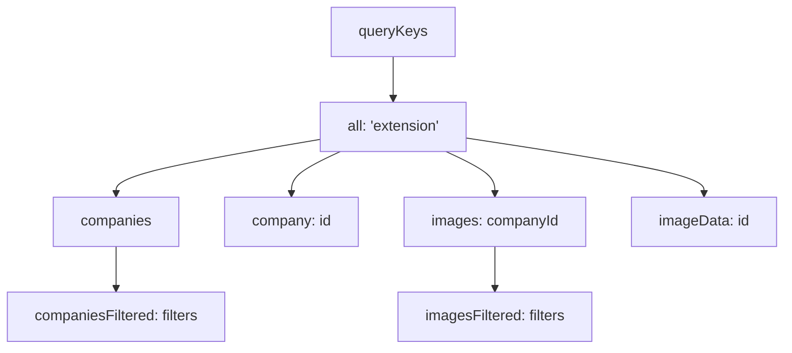
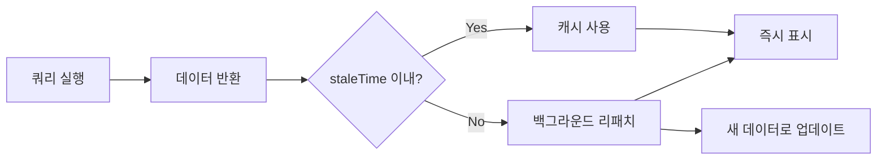
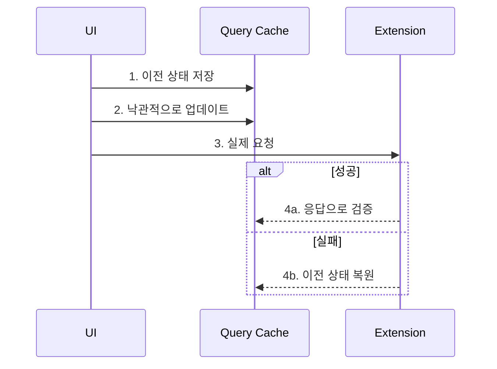
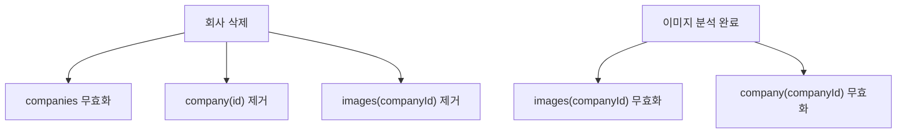

# React Query 사용 패턴

## 개요

TanStack Query(React Query)를 활용한 서버 상태 관리와 캐싱 전략입니다.

**참조 파일**:
- `spa/src/lib/query/keys.ts`
- `spa/src/hooks/useCompanies.ts`
- `spa/src/hooks/useImages.ts`

## 왜 React Query인가?

### 문제: 수동 상태 관리의 복잡성

```typescript
// 전통적인 방식
const [companies, setCompanies] = useState([]);
const [loading, setLoading] = useState(false);
const [error, setError] = useState(null);

useEffect(() => {
  setLoading(true);
  fetchCompanies()
    .then(setCompanies)
    .catch(setError)
    .finally(() => setLoading(false));
}, []);

// 캐싱? 리패칭? 동기화? 😰
```

### 해결: React Query

```typescript
const { data: companies, isLoading, error } = useQuery({
  queryKey: ['companies'],
  queryFn: () => client.send('GET_COMPANIES'),
});
// 캐싱, 리패칭, 동기화 자동 처리 ✨
```

## 핵심 개념

### 1. Query Key Factory 패턴



계층적 키 구조로 관련 쿼리를 그룹화합니다.

**구조 예시**:
```typescript
const queryKeys = {
  all: ['extension'] as const,
  companies: () => [...queryKeys.all, 'companies'] as const,
  companiesFiltered: (filters) => [...queryKeys.companies(), filters] as const,
  company: (id: string) => [...queryKeys.all, 'company', id] as const,
  images: (companyId: string) => [...queryKeys.all, 'images', companyId] as const,
  // ...
} as const;
```

**장점**:
- 일관된 키 구조
- 타입 안전성 (`as const`)
- 부분 무효화 가능 (`invalidateQueries({ queryKey: queryKeys.companies() })`)

### 2. staleTime 캐시 전략



| 데이터 종류 | staleTime | 이유 |
|------------|-----------|------|
| 회사 목록 | 30초 | 자주 변경되지 않음 |
| 이미지 목록 | 5분 | 분석 중 안정성 필요 |
| 이미지 데이터 | Infinity | 이미지 자체는 불변 |

### 3. Optimistic Update



**핵심**: 서버 응답을 기다리지 않고 UI를 즉시 업데이트하여 UX 향상

## 사용 패턴

### 조회 (useQuery)

```typescript
// 기본 조회
function useCompanies(filters?: CompanyFilters) {
  const client = getExtensionClient();

  return useQuery({
    queryKey: filters
      ? queryKeys.companiesFiltered(filters)
      : queryKeys.companies(),
    queryFn: () => client.send('GET_COMPANIES', filters),
    staleTime: 30_000,  // 30초
  });
}

// 조건부 조회
function useImages(companyId: string | undefined) {
  return useQuery({
    queryKey: queryKeys.images(companyId!),
    queryFn: () => client.send('GET_IMAGES', { companyId: companyId! }),
    enabled: !!companyId,  // companyId가 있을 때만 실행
  });
}
```

### 변경 (useMutation)

```typescript
function useDeleteCompany() {
  const client = getExtensionClient();
  const queryClient = useQueryClient();

  return useMutation({
    mutationFn: (companyId: string) =>
      client.send('DELETE_COMPANY', { companyId }),
    onSuccess: (_, companyId) => {
      // 관련 캐시 무효화
      queryClient.invalidateQueries({
        queryKey: queryKeys.companies()
      });
      queryClient.removeQueries({
        queryKey: queryKeys.company(companyId)
      });
      queryClient.removeQueries({
        queryKey: queryKeys.images(companyId)
      });
    },
  });
}
```

### Optimistic Update 구현

```typescript
function useUpdateImageMemo(companyId: string) {
  const client = getExtensionClient();
  const queryClient = useQueryClient();

  return useMutation({
    mutationFn: ({ imageId, memo }) =>
      client.send('UPDATE_IMAGE_MEMO', { imageId, memo }),

    onMutate: async ({ imageId, memo }) => {
      // 1. 진행 중인 쿼리 취소
      await queryClient.cancelQueries({
        queryKey: queryKeys.images(companyId)
      });

      // 2. 이전 상태 저장
      const previousImages = queryClient.getQueryData(
        queryKeys.images(companyId)
      );

      // 3. 낙관적 업데이트
      queryClient.setQueryData(
        queryKeys.images(companyId),
        (old: ImageMetaDTO[]) =>
          old?.map((img) =>
            img.id === imageId ? { ...img, memo } : img
          ) ?? []
      );

      // 4. 롤백용 컨텍스트 반환
      return { previousImages };
    },

    onError: (_err, _vars, context) => {
      // 실패 시 롤백
      if (context?.previousImages) {
        queryClient.setQueryData(
          queryKeys.images(companyId),
          context.previousImages
        );
      }
    },
  });
}
```

## 캐시 무효화 전략

### 연관 쿼리 무효화



**무효화 vs 제거**:
- `invalidateQueries`: 다음 접근 시 리패치
- `removeQueries`: 즉시 캐시에서 삭제 (더 이상 필요 없는 데이터)

### 부분 무효화

Query Key의 계층 구조를 활용:

```typescript
// 모든 회사 관련 쿼리 무효화
queryClient.invalidateQueries({ queryKey: queryKeys.companies() });

// 특정 회사의 모든 쿼리 무효화
queryClient.invalidateQueries({ queryKey: queryKeys.company(companyId) });

// 모든 쿼리 무효화 (로그아웃 등)
queryClient.invalidateQueries({ queryKey: queryKeys.all });
```

## 설계 결정

### 왜 Query Key Factory인가?

**대안: 문자열 하드코딩**
```typescript
queryKey: ['extension', 'companies']
// 오타 위험, 일관성 부족
```

**Factory 패턴**
```typescript
queryKey: queryKeys.companies()
// 타입 안전, 자동 완성, 일관성
```

### 왜 긴 staleTime인가?

이 프로젝트는 Extension에 데이터가 저장되고, SPA는 조회/분석만 합니다:
- 데이터 변경이 드물음
- 분석 중 일관성이 중요함
- 불필요한 리패치 방지

### 왜 Optimistic Update인가?

메모 수정 같은 작업은:
- 실패할 가능성이 낮음
- 사용자 입력에 즉각 반응해야 함
- 실패해도 롤백이 간단함

## 관련 문서

- [Extension-SPA 통신](./07-extension-spa-communication.md) - queryFn의 데이터 소스
- [타입 안전 메시징](./08-type-safe-messaging.md) - 타입 안전한 API 호출
