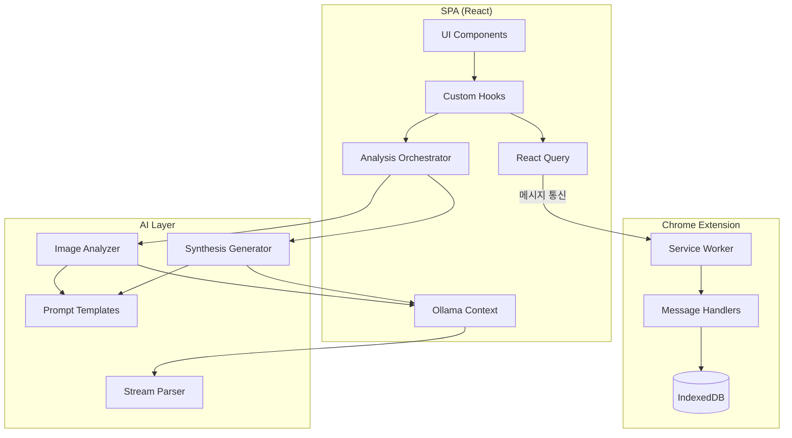

# AI Company Analyzer - SPA 학습 가이드

이 문서는 `ai-company-analyzer` 프로젝트에서 배울 수 있는 주요 아키텍처 패턴과 AI 분석 기법을 정리합니다.

## 전체 아키텍처 개요



## 권장 학습 순서

### Phase 1: 아키텍처 기초 (먼저 읽기 권장)
1. [Extension-SPA 메시지 통신](./07-extension-spa-communication.md) - Extension과 SPA가 어떻게 대화하는지
2. [타입 안전 메시지 프로토콜](./08-type-safe-messaging.md) - 타입 안전한 메시지 설계 방법
3. [React Query 패턴](./09-react-query-patterns.md) - 서버 상태 관리와 캐싱 전략

### Phase 2: AI 분석 흐름
4. [Orchestrator 패턴](./01-orchestrator-pattern.md) - 복잡한 분석 흐름 조율
5. [스트리밍 아키텍처](./02-streaming-architecture.md) - 실시간 AI 응답 처리
6. [프롬프트 템플릿 시스템](./03-prompt-template-system.md) - 유연한 프롬프트 관리

### Phase 3: 구현 세부사항
7. [스트림 파싱 기법](./04-stream-parsing.md) - 스트림 데이터 안전 파싱
8. [React 스트리밍 최적화](./05-react-streaming-optimization.md) - 성능 최적화 기법
9. [Ollama API 통합](./06-ollama-integration.md) - 로컬 LLM 연동

## 문서별 요약

| 문서 | 핵심 개념 | 난이도 |
|------|----------|--------|
| Orchestrator 패턴 | 다단계 작업 조율, DI, 에러 격리 | 중 |
| 스트리밍 아키텍처 | AsyncGenerator, thinking/content 분리 | 상 |
| 프롬프트 템플릿 | Handlebars 유사 문법, 변수 치환 | 하 |
| 스트림 파싱 | JSON 추출, 멀티바이트 처리 | 중 |
| React 스트리밍 최적화 | ref 활용, requestAnimationFrame | 상 |
| Ollama 통합 | React Context, Vision 모델 | 중 |
| Extension-SPA 통신 | onMessageExternal, 핸들러 레지스트리 | 중 |
| 타입 안전 메시징 | Discriminated Union, 제네릭 매핑 | 상 |
| React Query 패턴 | Query Key Factory, Optimistic Update | 중 |

## 주요 소스 파일 참조

### AI 분석 관련
```
spa/src/lib/analysis/
├── orchestrator.ts      # 분석 흐름 조율
├── image-analyzer.ts    # 개별 이미지 분석
├── synthesis.ts         # 종합 분석 생성
├── image-loader.ts      # 이미지 로드 및 최적화
└── types.ts             # 분석 타입 정의

spa/src/lib/prompts/
├── defaults.ts          # 기본 프롬프트 템플릿
└── index.ts             # 템플릿 보간 함수

spa/src/lib/ai/
└── stream-parser.ts     # 스트림 파싱 유틸리티
```

### 아키텍처 관련
```
shared/types/
└── messages.ts          # 메시지 프로토콜 정의

extension/src/background/
├── external-api.ts      # 메시지 핸들러 등록
└── handlers/            # 핸들러 구현

spa/src/lib/
├── extension-client/    # Extension 통신 클라이언트
└── query/keys.ts        # Query Key Factory

spa/src/hooks/
├── useCompanies.ts      # 회사 데이터 훅
├── useImages.ts         # 이미지 데이터 훅
└── useAnalysisSession.ts # 분석 세션 관리
```

## 학습 팁

1. **코드를 직접 읽어보세요**: 각 문서에서 참조하는 소스 파일을 함께 읽으면 이해가 깊어집니다
2. **다이어그램을 먼저 이해하세요**: 전체 흐름을 파악한 후 세부 구현을 보면 컨텍스트가 명확해집니다
3. **실제로 실행해보세요**: 브라우저 DevTools로 메시지 흐름을 추적하면 동작을 직접 확인할 수 있습니다

## 연관 문서

- [프로젝트 README](/extensions/ai-company-analyzer/README.md)
- [API 문서](/extensions/ai-company-analyzer/docs/spa-with-extension/)
